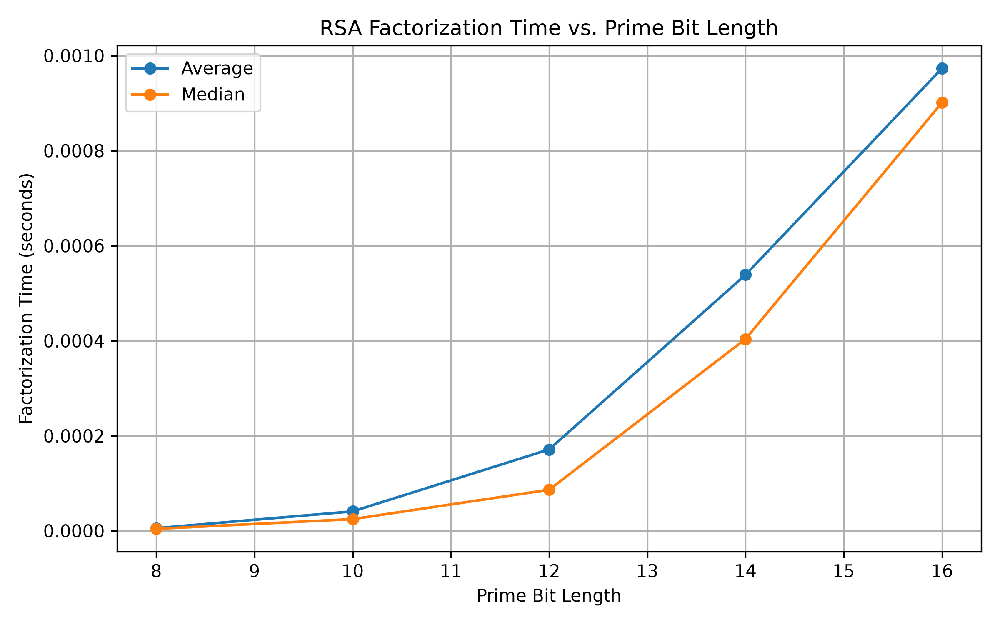

# Cryptographic Algorithm & Attack Lab

An applied mathematics and cryptography project implementing foundational cryptographic algorithms, classical cryptanalysis techniques, and attacks against deliberately weakened cryptographic systems.

The project explores the mathematical principles underlying RSA, Diffie-Hellman key exchange, digital signatures, Caesar and Vigenère ciphers, and demonstrates how weaknesses in key size and cipher structure can be exploited through cryptanalysis.

## Project Goals

- Implement cryptographic algorithms from their mathematical foundations.
- Apply number theory and modular arithmetic to public-key cryptography.
- Implement classical cryptanalysis using frequency analysis and the Index of Coincidence.
- Demonstrate the vulnerability of deliberately weak RSA keys through modulus factorization and private-key recovery.
- Experimentally measure how factorization difficulty changes as RSA key size increases.
- Validate implementations using automated tests.

## Features

### Number Theory Utilities

Implemented mathematical functions used throughout the cryptographic algorithms:

- Euclidean algorithm for computing greatest common divisors (GCD).
- Extended Euclidean algorithm for finding Bézout coefficients.
- Modular multiplicative inverses.
- Probabilistic primality testing and random prime generation.

These components provide the mathematical foundation for RSA key generation and private-key recovery.

### RSA Cryptosystem

Implemented RSA from its mathematical foundations, including:

- Prime generation.
- Public and private key generation.
- Euler's totient calculation.
- Modular inverse calculation for the private exponent.
- Integer encryption and decryption.
- Text-to-integer encoding and decoding.

RSA key generation is based on:

`n = p × q`

`φ(n) = (p - 1)(q - 1)`

and the private exponent `d` satisfies:

`ed ≡ 1 (mod φ(n))`

### Digital Signatures

Implemented an educational RSA digital-signature system using SHA-256 hashing.

The implementation demonstrates:

- Message hashing.
- Signing with an RSA private key.
- Verification with the corresponding public key.
- Detection of modified messages.

The implementation is intended for educational purposes and does not implement production RSA signature padding such as RSA-PSS.

### Diffie-Hellman Key Exchange

Implemented Diffie-Hellman key exchange to demonstrate how two parties can independently derive the same shared secret over a public channel.

Alice and Bob compute public values from independently selected private keys and ultimately derive the same value:

`g^(ab) mod p`

without directly transmitting the shared secret.

### Classical Cryptography

Implemented:

- Caesar cipher encryption and decryption.
- Vigenère cipher encryption and decryption.

### Classical Cryptanalysis

Implemented automated attacks against classical ciphers using statistical properties of English text:

- Caesar cipher brute-force analysis.
- English letter-frequency scoring.
- Index of Coincidence (IC).
- Vigenère key-length estimation.
- Vigenère key recovery through column-based frequency analysis.

For a candidate Vigenère key length, ciphertext letters are divided into columns. Each column can then be analyzed as a Caesar cipher because letters in the same column were encrypted using the same Vigenère key character.

### Weak-RSA Factorization Attack

Implemented an educational attack against deliberately small RSA keys.

Given only an RSA public key `(e, n)`, the attack:

1. Factors `n` to recover `p` and `q`.
2. Reconstructs `φ(n)`.
3. Computes the private exponent `d`.
4. Reconstructs the private key.
5. Decrypts ciphertext without access to the original private key.

Trial division is intentionally used to demonstrate why sufficiently small RSA moduli are insecure. This attack is not practical against properly generated modern RSA keys.

## RSA Factorization Experiment

To examine the relationship between RSA key size and the computational cost of naive factorization, the project includes an experiment that generates deliberately small RSA keys and measures the time required to factor their moduli using trial division.

Each prime bit length is tested across 20 independently generated keys. Both the mean and median factorization times are calculated to reduce the influence of individual randomly generated moduli.

### Experimental Method

Prime sizes tested:

- 8 bits
- 10 bits
- 12 bits
- 14 bits
- 16 bits

For each size:

1. Generate an RSA key pair.
2. Extract the public modulus `n`.
3. Factor `n` using trial division.
4. Measure the factorization time using `time.perf_counter()`.
5. Repeat the experiment 20 times.
6. Calculate the mean and median factorization times.

The experiment automatically exports the numerical results to CSV and generates a visualization using Matplotlib.

### Results



The experiment demonstrates a clear increase in the computational cost of trial-division factorization as the prime bit length increases.

Because the RSA primes are generated randomly, individual timing measurements vary between runs. Repeating each experiment and reporting both the mean and median provides a more representative view of the overall trend.

These results illustrate the central security principle behind RSA: recovering the private key from the public modulus depends on the difficulty of factoring the product of two sufficiently large primes.

> **Note:** The key sizes used in this experiment are intentionally tiny and are suitable only for educational analysis. They do not represent secure RSA key sizes or the performance of modern integer-factorization algorithms.

## Project Structure

```text
cryptographic-algorithm-attack-lab/
│
├── src/
│   ├── attacks/
│   │   └── rsa_factorization.py
│   │
│   ├── classical/
│   │   ├── caesar.py
│   │   ├── frequency_analysis.py
│   │   ├── vigenere.py
│   │   └── vigenere_analysis.py
│   │
│   ├── diffie_hellman.py
│   ├── math_utils.py
│   ├── primes.py
│   ├── rsa.py
│   └── signatures.py
│
├── tests/
│   ├── test_caesar.py
│   ├── test_diffie_hellman.py
│   ├── test_frequency_analysis.py
│   ├── test_math_utils.py
│   ├── test_primes.py
│   ├── test_rsa.py
│   ├── test_rsa_attack.py
│   ├── test_signatures.py
│   ├── test_vigenere.py
│   └── test_vigenere_analysis.py
│
├── experiments/
│   ├── rsa_factorization_timing.py
│   ├── rsa_factorization_results.csv
│   └── rsa_factorization_timing.png
│
├── .gitignore
└── README.md
```

## Testing

The project includes **22 automated tests** using `pytest`.

The test suite covers:

- Number-theory utilities
- Prime generation
- RSA encryption and decryption
- RSA digital signatures
- Diffie-Hellman shared-secret generation
- Caesar cipher encryption and decryption
- Caesar cryptanalysis
- Vigenère cipher encryption and decryption
- Index of Coincidence calculations
- Vigenère key-length estimation and key recovery
- RSA modulus factorization
- RSA private-key recovery and ciphertext decryption

Run the complete test suite from the project root with:

```bash
python -m pytest
```

## Technologies

- Python
- pytest
- Matplotlib
- SHA-256 via Python's `hashlib`
- Git and GitHub

## Mathematical Concepts

The project applies concepts from number theory, abstract algebra, probability, statistics, and cryptography, including:

- Modular arithmetic
- Greatest common divisors
- Bézout's identity
- Extended Euclidean algorithm
- Modular multiplicative inverses
- Prime numbers and primality testing
- Euler's totient function
- Modular exponentiation
- Public-key cryptography
- Frequency distributions
- Index of Coincidence
- Statistical cryptanalysis

## Running the RSA Factorization Experiment

From the project root:

```bash
python -m experiments.rsa_factorization_timing
```

The experiment generates:

```text
experiments/rsa_factorization_results.csv
experiments/rsa_factorization_timing.png
```

The CSV contains the numerical results, while the PNG contains the generated factorization-time visualization.

## Educational Scope

This repository was built to explore the mathematics underlying cryptographic systems and cryptanalysis.

The cryptographic implementations are intentionally constructed for educational analysis and should **not** be used to protect real-world sensitive information. Production cryptographic software requires standardized algorithms, secure parameter sizes, padding schemes, side-channel protections, secure randomness, and extensively reviewed implementations.

The deliberately small RSA keys used by the attack experiments are designed to make factorization computationally feasible for demonstration purposes.

## Future Work

Possible extensions include:

- Comparing additional integer-factorization algorithms.
- Expanding RSA performance experiments to additional key sizes.
- Adding further classical cryptanalysis techniques.
- Comparing theoretical and experimentally observed attack complexity.
- Extending the statistical analysis of Vigenère key recovery.